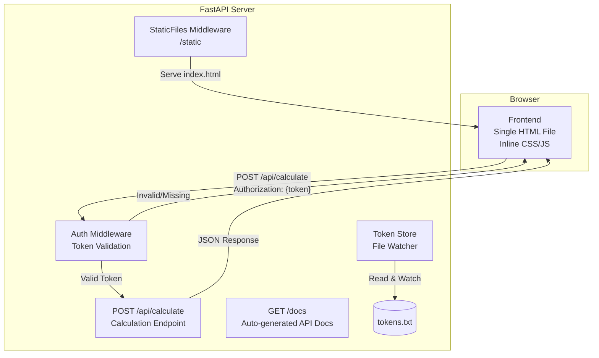

# Design Document: Poisson Calculator

## Overview

The Poisson Calculator is a web application that converts an observed probability of an event occurring within a time window into an annualized frequency using the Poisson distribution. The system follows a browser/server (B/S) architecture with a FastAPI backend exposing REST API endpoints and a plain HTML/CSS/JS frontend served as a single static file.

The core computation inverts the Poisson CDF — given a probability P of at least one event in a window, it derives λ = −ln(1 − P/100), then scales λ from the window duration to a full year (8766 hours). The backend returns all intermediate calculation steps for transparency.

Authentication uses UUID tokens stored in a server-side plain-text flat file. The frontend handles timezone-aware timestamp input, defaulting Start to "Now" in the browser's local timezone and End's timezone to US Eastern. A mode selector supports future extensibility beyond Poisson.

## Architecture



### Key Architectural Decisions

1. **Single POST endpoint** (`/api/calculate`): All inputs (time range, window, probability, mode) are submitted together in one request. This simplifies the frontend (one fetch call per calculation) and keeps validation atomic — the backend validates everything at once and returns all errors together.

2. **Backend-only validation**: All validation lives in the backend via Pydantic models. The frontend does not duplicate validation logic; it submits inputs and displays whatever errors the backend returns. This avoids logic drift between frontend and backend.

3. **Static file serving from FastAPI**: The backend mounts a `StaticFiles` directory and serves `index.html` directly. No separate web server or build step is needed. During development, CORS middleware allows the frontend to be served from a different origin if desired.

4. **File-based token store with reload**: Tokens are stored one-per-line in a plain text file. The backend loads tokens at startup and watches for file modifications to reload without restart. This keeps the auth mechanism simple and operator-friendly (add/remove tokens by editing a text file).

5. **UTC normalization**: The frontend sends ISO 8601 timestamps with offset. The backend converts all timestamps to UTC immediately upon receipt for consistent internal computation. Responses include UTC representations.

## Components and Interfaces

### Backend Components

#### 1. `main.py` — Application Entry Point

Sets up the FastAPI application, mounts static files, registers CORS middleware, and includes the API router.

```python
# Responsibilities:
# - Create FastAPI app instance
# - Mount /static directory for frontend files
# - Add CORS middleware
# - Include API router
# - Serve index.html at root path
```

#### 2. `auth.py` — Authentication Module

Manages token loading, file watching, and request authentication.

```python
class TokenStore:
    """Loads tokens from a flat file and watches for changes."""
    
    def __init__(self, token_file_path: str): ...
    def load_tokens(self) -> None: ...
    def is_valid(self, token: str) -> bool: ...
    def reload_if_modified(self) -> None: ...

async def verify_token(authorization: str = Header(...)) -> str:
    """FastAPI dependency that extracts and validates the auth token."""
    ...
```

- `TokenStore` reads the token file at startup, stores tokens in a `set` for O(1) lookup, and tracks the file's last-modified timestamp to detect changes.
- `verify_token` is a FastAPI dependency injected into protected endpoints. It extracts the token from the `Authorization` header, calls `TokenStore.reload_if_modified()`, then validates.
- If the token file is missing or unreadable at startup, `TokenStore` logs an error and the `is_valid` method returns `False` for all tokens until a valid file is available.

#### 3. `models.py` — Pydantic Request/Response Models

Defines all data structures for API communication.

```python
class TimestampRange(BaseModel):
    start: datetime  # ISO 8601 with timezone offset
    end: datetime    # ISO 8601 with timezone offset

class WindowDuration(BaseModel):
    days: int        # >= 0
    hours: int       # 0-23

class CalculationRequest(BaseModel):
    time_range: TimestampRange
    window: WindowDuration
    probability: float  # (0, 100) exclusive
    mode: str = "poisson"

class CalculationSteps(BaseModel):
    lambda_value: float
    window_hours: float
    scaling_factor: float
    annualized_frequency: float

class CalculationResponse(BaseModel):
    mode: str
    time_range_utc: TimestampRange
    steps: CalculationSteps

class ErrorDetail(BaseModel):
    field: str
    message: str

class ErrorResponse(BaseModel):
    errors: list[ErrorDetail]
```

#### 4. `calculator.py` — Calculation Logic

Pure functions implementing the Poisson math, separated from HTTP concerns.

```python
import math

def compute_lambda(probability_pct: float) -> float:
    """λ = −ln(1 − probability / 100)"""
    return -math.log(1 - probability_pct / 100)

def compute_window_hours(days: int, hours: int) -> float:
    """Total window duration in hours."""
    return (days * 24) + hours

def compute_scaling_factor(window_hours: float, hours_in_year: float = 8766.0) -> float:
    """Ratio to scale from window to one year."""
    return hours_in_year / window_hours

def compute_annualized_frequency(lambda_val: float, scaling_factor: float) -> float:
    """Scale lambda from window duration to annual."""
    return round(lambda_val * scaling_factor, 2)

def calculate_poisson(probability_pct: float, days: int, hours: int) -> CalculationSteps:
    """Run the full Poisson calculation pipeline, returning all steps."""
    lambda_val = compute_lambda(probability_pct)
    window_hours = compute_window_hours(days, hours)
    scaling_factor = compute_scaling_factor(window_hours)
    annualized_freq = compute_annualized_frequency(lambda_val, scaling_factor)
    return CalculationSteps(
        lambda_value=lambda_val,
        window_hours=window_hours,
        scaling_factor=scaling_factor,
        annualized_frequency=annualized_freq,
    )
```

#### 5. `routes.py` — API Route Handlers

Defines the POST endpoint, wires up auth dependency, and handles validation errors.

```python
@router.post("/api/calculate", response_model=CalculationResponse)
async def calculate(
    request: CalculationRequest,
    token: str = Depends(verify_token),
) -> CalculationResponse:
    """
    Validate inputs, run Poisson calculation, return steps.
    - Converts timestamps to UTC
    - Validates start < end, window > 0, 0 < probability < 100
    - Returns structured errors or calculation results
    """
    ...
```

### Frontend Components

#### 6. `index.html` — Single-Page Frontend

A single HTML file containing inline CSS and JavaScript. No build tools or frameworks.

**Structure:**
- **Mode Selector**: Dropdown with "Poisson" as the only option. State is preserved per mode.
- **Time Range Section**: Two timestamp selectors (Start, End) with date, time, and timezone inputs. Start defaults to "Now" in browser local TZ. End defaults to US Eastern TZ.
- **Window Duration Section**: Two numeric inputs for days (≥0) and hours (0–23).
- **Probability Section**: Single numeric input for percentage.
- **Calculate Button**: Submits all inputs to `POST /api/calculate`.
- **Results Section**: Displays calculation steps (λ, window_hours, scaling_factor) and the final annualized frequency. Hidden when validation errors are present.
- **Error Display**: Per-field error messages shown adjacent to the corresponding inputs.

**JavaScript Responsibilities:**
- Collect inputs, format timestamps as ISO 8601 with offset, and POST to the API.
- Parse API responses: display results on success, display field-level errors on validation failure.
- Handle the "Now" button to populate Start with `new Date().toISOString()` in local TZ.
- Maintain per-mode input state in a JS object so switching modes preserves values.
- Include the auth token in the `Authorization` header on every request.

### API Interface

| Method | Path | Auth | Request Body | Success Response | Error Response |
|--------|------|------|-------------|-----------------|----------------|
| POST | `/api/calculate` | Required | `CalculationRequest` | `200 CalculationResponse` | `422 ErrorResponse` or `401 Unauthorized` |
| GET | `/docs` | None | — | Swagger UI | — |
| GET | `/` | None | — | `index.html` | — |

## Data Models

### Request Model: `CalculationRequest`

| Field | Type | Constraints | Description |
|-------|------|-------------|-------------|
| `time_range.start` | `datetime` | Must include TZ offset, must be before `end` | Start of observation period |
| `time_range.end` | `datetime` | Must include TZ offset | End of observation period |
| `window.days` | `int` | ≥ 0 | Days component of window duration |
| `window.hours` | `int` | 0–23 | Hours component of window duration |
| `probability` | `float` | (0, 100) exclusive | Observed probability percentage |
| `mode` | `str` | Default: `"poisson"` | Calculation mode identifier |

**Cross-field validations (enforced by Pydantic validators):**
- `start` must be strictly before `end` (after UTC conversion)
- `days * 24 + hours` must be > 0 (window cannot be zero)

### Response Model: `CalculationResponse`

| Field | Type | Description |
|-------|------|-------------|
| `mode` | `str` | The calculation mode used |
| `time_range_utc.start` | `datetime` | Start timestamp converted to UTC |
| `time_range_utc.end` | `datetime` | End timestamp converted to UTC |
| `steps.lambda_value` | `float` | λ = −ln(1 − probability/100) |
| `steps.window_hours` | `float` | (days × 24) + hours |
| `steps.scaling_factor` | `float` | 8766 / window_hours |
| `steps.annualized_frequency` | `float` | λ × scaling_factor, rounded to 2 decimal places |

### Error Model: `ErrorResponse`

| Field | Type | Description |
|-------|------|-------------|
| `errors` | `list[ErrorDetail]` | List of validation errors |
| `errors[].field` | `str` | The input field that failed validation (e.g., `"probability"`, `"time_range.start"`) |
| `errors[].message` | `str` | Human-readable error description |

### Token Store Format

Plain text file (`tokens.txt`), one UUID token per line:

```
550e8400-e29b-41d4-a716-446655440000
6ba7b810-9dad-11d1-80b4-00c04fd430c8
```

- Blank lines and lines that are not valid UUIDs are ignored during loading.
- The file is read at startup and re-read when its modification timestamp changes.


## Correctness Properties

*A property is a characteristic or behavior that should hold true across all valid executions of a system — essentially, a formal statement about what the system should do. Properties serve as the bridge between human-readable specifications and machine-verifiable correctness guarantees.*

### Property 1: Calculation pipeline correctness

*For any* valid probability in (0, 100) and any valid window duration (days ≥ 0, hours in 0–23, total > 0), the backend calculation SHALL produce:
- `lambda_value` equal to `−ln(1 − probability / 100)`
- `window_hours` equal to `(days × 24) + hours`
- `scaling_factor` equal to `8766 / window_hours`
- `annualized_frequency` equal to `round(lambda_value × scaling_factor, 2)`

and the `annualized_frequency` SHALL have at most two decimal places.

**Validates: Requirements 4.1, 4.2, 4.3, 4.4**

### Property 2: Time range validation rejects invalid ranges

*For any* pair of timestamps where `start` is equal to or later than `end` (after UTC conversion), the backend SHALL return a validation error identifying the `time_range` field.

**Validates: Requirements 1.6**

### Property 3: Window validation rejects invalid inputs

*For any* window input where days is negative, hours is outside 0–23, either value is non-integer, or the total duration is zero, the backend SHALL return a validation error identifying the `window` field.

**Validates: Requirements 2.2, 2.3, 2.4**

### Property 4: Probability validation rejects out-of-range values

*For any* probability value that is ≤ 0, ≥ 100, or non-numeric, the backend SHALL return a validation error identifying the `probability` field.

**Validates: Requirements 3.2, 3.3**

### Property 5: Structured validation errors identify all invalid fields

*For any* calculation request containing one or more invalid inputs, the backend SHALL return a structured error response where each error entry identifies the specific invalid field and includes a human-readable message, and the set of identified fields matches exactly the set of fields that are invalid.

**Validates: Requirements 5.1, 8.3**

### Property 6: UTC timezone conversion preserves absolute time

*For any* input timestamp with a timezone offset, the backend SHALL convert it to UTC such that the resulting UTC timestamp represents the same absolute point in time, and all timestamps in the API response SHALL have UTC offset (Z or +00:00).

**Validates: Requirements 9.2, 9.3**

### Property 7: Auth token gate

*For any* API request to a protected endpoint, the request SHALL succeed (receive a non-401 response) if and only if the `Authorization` header contains a token that exists in the Token Store. Requests with missing or invalid tokens SHALL receive an HTTP 401 response.

**Validates: Requirements 10.3, 10.5, 10.6**

## Error Handling

### Backend Error Categories

| Error Type | HTTP Status | Trigger | Response Format |
|-----------|-------------|---------|-----------------|
| Validation Error | 422 | Invalid inputs (Pydantic or custom validators) | `ErrorResponse` with per-field `ErrorDetail` entries |
| Authentication Error | 401 | Missing or invalid `Authorization` header | `{"detail": "Auth token is required"}` or `{"detail": "Auth token is invalid"}` |
| Token Store Unavailable | 401 | Token file missing/unreadable at startup | `{"detail": "Authentication service unavailable"}` |
| Internal Server Error | 500 | Unexpected exceptions | `{"detail": "Internal server error"}` |

### Validation Error Handling Strategy

1. **Pydantic-level validation**: Type coercion failures (non-numeric values, missing fields) are caught by Pydantic and transformed into structured `ErrorResponse` format via a custom exception handler.

2. **Cross-field validation**: Business rules that span multiple fields (start < end, window > 0) are implemented as Pydantic `model_validator` methods. These raise `ValueError` with field-specific messages that are caught and formatted into `ErrorResponse`.

3. **Error aggregation**: When multiple fields are invalid, all errors are collected and returned together in a single response. The frontend does not need multiple round-trips to discover all issues.

### Frontend Error Handling

1. **Network errors**: If the fetch call fails (server unreachable, timeout), display a general error banner above the form.
2. **401 responses**: Display a message indicating the auth token is invalid or missing. Prompt the user to check their token configuration.
3. **422 responses**: Parse the `ErrorResponse` body, match each `ErrorDetail.field` to the corresponding input element, and display the error message adjacent to it. Hide the results section.
4. **Successful responses**: Clear all error displays and show the calculation results.

### Token Store Error Handling

1. **File missing at startup**: Log an error with the expected file path. Set the token set to empty, causing all auth checks to fail. Do not crash the server.
2. **File becomes unreadable after startup**: Keep the last successfully loaded token set. Log a warning. Retry on next request.
3. **Malformed lines**: Skip lines that are not valid UUIDs. Log a warning for each skipped line. Continue loading valid tokens.

## Testing Strategy

### Testing Framework

- **Backend**: `pytest` with `httpx` for async API testing
- **Property-based testing**: `hypothesis` library for Python
- **Frontend**: Manual testing supplemented by example-based checks

### Property-Based Tests

Each correctness property from the design document is implemented as a `hypothesis` property-based test with a minimum of 100 iterations.

| Property | Test Description | Generator Strategy |
|----------|-----------------|-------------------|
| P1: Calculation pipeline | Generate random valid probability (0, 100) and window (days ≥ 0, hours 0–23, total > 0). Verify all calculation steps match formulas. | `st.floats(min_value=0.001, max_value=99.999)` for probability; `st.integers(0, 365)` for days; `st.integers(0, 23)` for hours; filter total > 0 |
| P2: Time range validation | Generate random datetime pairs where start ≥ end. Verify validation error. | `st.datetimes()` with timezone strategy, constrained so start ≥ end |
| P3: Window validation | Generate invalid window inputs: negative days, hours outside 0–23, zero total. Verify validation error. | `st.one_of()` combining negative ints, out-of-range hours, and (0, 0) |
| P4: Probability validation | Generate probability values ≤ 0 or ≥ 100. Verify validation error. | `st.one_of(st.floats(max_value=0), st.floats(min_value=100))` |
| P5: Structured errors | Generate requests with random combinations of invalid fields. Verify error response identifies exactly those fields. | Composite strategy combining valid/invalid values per field |
| P6: UTC conversion | Generate timestamps with random timezone offsets. Verify UTC conversion preserves absolute time. | `st.datetimes(timezones=st.timezones())` |
| P7: Auth token gate | Generate random UUID strings, some in the store and some not. Verify access is granted iff token is valid. | `st.uuids()` combined with a known valid token set |

Each test is tagged with a comment:
```python
# Feature: poisson-calculator, Property 1: Calculation pipeline correctness
```

### Unit Tests (Example-Based)

| Area | Test Cases |
|------|-----------|
| Calculation | Known input/output pairs: e.g., probability=50%, window=24h → verify exact lambda, scaling_factor, annualized_frequency |
| Validation | Specific edge cases: probability=0, probability=100, window=(0,0), start==end |
| Auth | Missing header → 401, invalid UUID → 401, valid UUID → 200 |
| Token Store | Load from file, reload on modification, handle missing file |
| API structure | Response contains all expected fields, /docs returns 200 |

### Integration Tests

| Scenario | Description |
|----------|-------------|
| End-to-end calculation | Submit valid request with auth token, verify full response structure and values |
| Token reload | Modify token file while server is running, verify new tokens are accepted |
| Static file serving | Verify GET / returns the HTML frontend |
| CORS headers | Verify CORS headers are present in responses |

### Test Organization

```
tests/
├── test_calculator.py      # Property tests + unit tests for calculation logic
├── test_validation.py      # Property tests + unit tests for input validation
├── test_auth.py            # Property tests + unit tests for authentication
├── test_timezone.py        # Property tests for UTC conversion
├── test_api.py             # Integration tests for API endpoints
└── conftest.py             # Shared fixtures (test client, token store setup)
```
